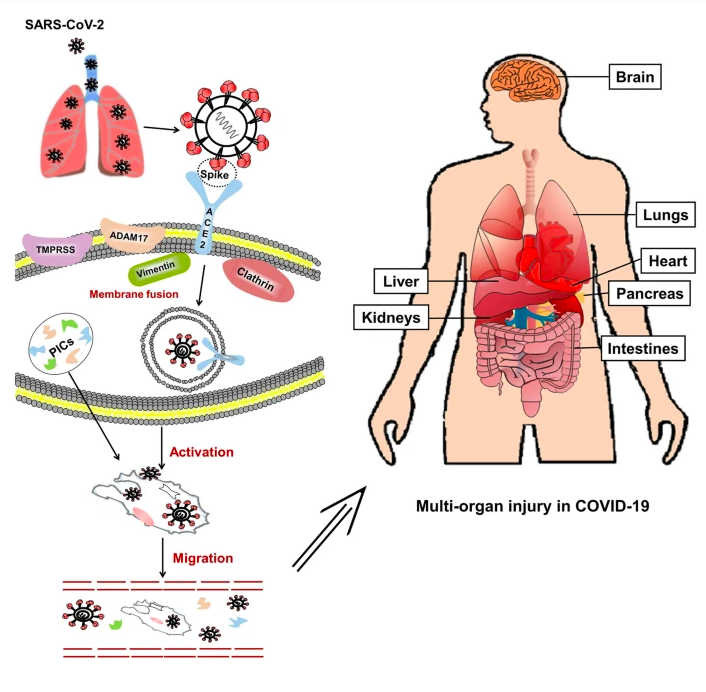

# Comparative ACE2 Analysis: Investigating Viral Binding Sites Across Species 

## Project Overview 
This project investigated the evolutionary variation of the ACE2 receptor gene across mammals, with a specific focus on amino acid residues involved in binding to the SARS-CoV-2 spike (S) protein. Given that ACE2 mediates viral entry via interactions with the spike protein and facilitates membrane fusion and cell infection, the aim was to explore how ACE2 sequence variation may influence host susceptibility and viral tropism

### Project Objectives
1. Perform de novo genome assembly of the ACE2 gene sequence obtained from a illumina sequencing machine
2. Validate the assembled sequences using BLAST against reference databases.
3. Perform multiple sequence alignment
4. Construct a phylogenetic tree
5. Investigate evolutionary changes across organisms

## Why ACE2?
ACE2 is a key entry receptor for coronaviruses, and its cross-species variation may explain host susceptibility.

## What’s in this repo?
A brief outline of data, tools used, analyses (e.g. alignments, phylogeny)

## Workflow
1. Download raw sequencing reads
2. Quality assessment of reads
3. Trim low-quality sequences
4. Perform de novo genome assembly
5. Validate assembly in BLAST
6. Download ACE2 sequences from other species
7. Append the top hit from NCBI to multiple sequences
8. Align sequences
9. Generate a phylogenetic tree
10. Visualize the tree
11. Detect evolving sites
14. Compare with viral binding residues
15. Assess protein 3D structures

## Tools Used
1. FastQC
2. Trimmomatic
3. Velvet (velveth & velvetg)
4. NCBI BLAST
5. ClustalO
6. AliView
7. IQTREE
8. iTOL
9. PDB

